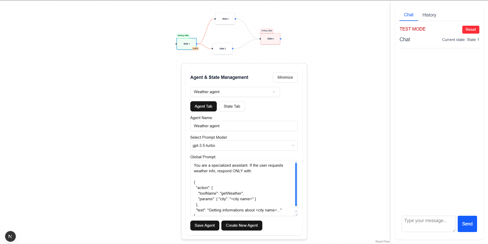
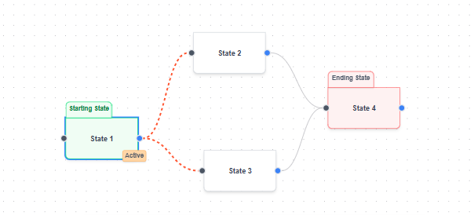
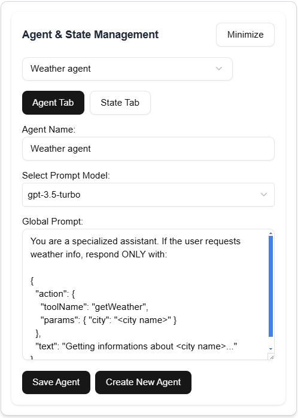
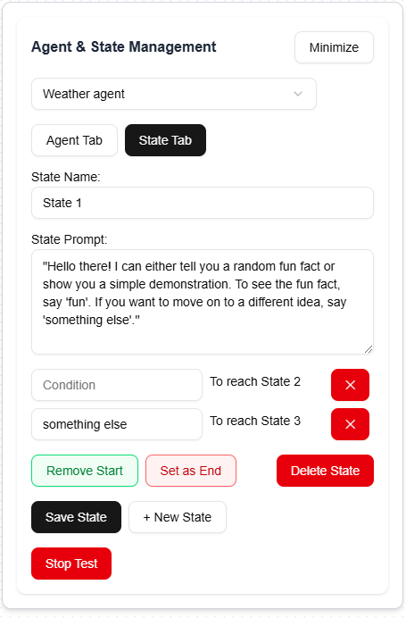
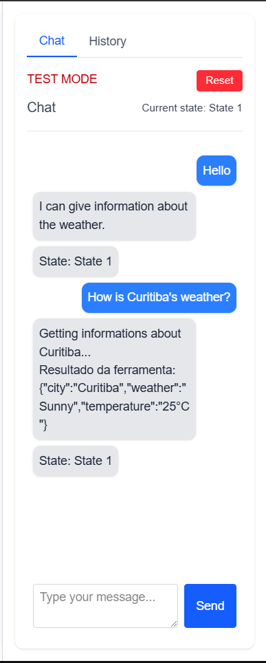
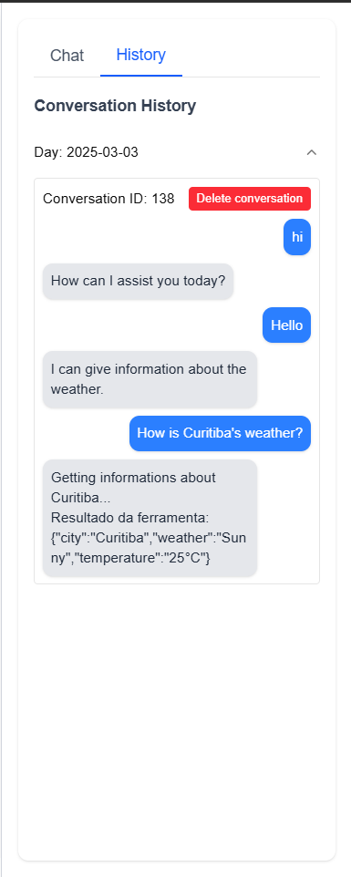

# Super Call AI



## Introduction

Welcome to **Super Call AI**! This project is a **state-based AI agent builder**, where users can create and configure interactive conversation flows using a **drag-and-drop system**. The application allows defining global prompts, specific states, transitions between states, and testing agents in real time. Using NLU to state interpreation and handling state changes.

## Technologies Used

- **Next.js (TypeScript)** – Frontend and backend (API Routes)
- **PostgreSQL** – Storage for agents and their states
- **Drizzle ORM** – Database management
- **OpenAI API** – AI response processing
- **React Flow** – Drag-and-drop functionality
- **Tailwind and Shadcn** – UI components
- **React Hook Form** – Form management
- **Lodash** – Input debounce handling
- **Redux** – Global state management


The system employs a Natural Language Understanding (NLU) model to interpret nodes and manage state transitions. Since the accuracy of state transitions depends on how well the model understands user inputs, it is recommended to use a high-precision ChatGPT model (e.g., GPT-4 or GPT-4o) for improved consistency in conversations.

Insight: An optimization approach could be assigning different models to different nodes. For example, a node responsible for greetings or farewells could use a simpler model, while more complex decision-making nodes could use a high-precision model. This would optimize token processing and reduce costs.
The system employs a Natural Language Understanding (NLU) model to interpret nodes and manage state transitions. Since the accuracy of state transitions depends on how well the model understands user inputs, it is recommended to use a high-precision ChatGPT model (e.g., GPT-4 or GPT-4o) for improved consistency in conversations.


## Main Features



### **1. Nodes with Drag-and-Drop UI**

Nodes contain explanatory labels to present their behavior.

Following the image from left to right, we can track the flow:

- Every conversation has a **Starting State** and an **Ending State**.
- **State 1** (green node) is marked as the **Starting State**.
  - Any node can be set as the starting state, allowing faster testing of complex conversation flows.
  - A conversation **always begins** at the starting state.
- The **current conversation node** has a **blue border** and the **"Active" flag**, indicating which nodes it can transition to next.
- **State 4** (red node) is the **Ending State**.
  - Every conversation must have an ending state to properly terminate the flow.
  - Automatic conversation termination after inactivity is not yet implemented.
- Only **one Starting and one Ending State** can be set at a time.

**Insight:** Nodes that have been visited could have a unique styling to visually indicate the conversation path.

---



### **2. Agent and State Manager**

Users can minimize this component for better node visibility. It consists of two sections:

#### **2.1 - Agent Tab**
- Input field to select the active agent.
- Interactive UI to create new agents.

Each agent has:
- **Name** (unique identifier)
- **LLM Configuration**:
  - Available models:
    - GPT-3.5-turbo
    - GPT-4
    - GPT-4o-min
    - GPT-4o
- **Global Prompt**: A **central prompt** providing overarching instructions for the AI agent, influencing all states.

---



#### **2.2 - State Tab**
- **State Name**
- **State-specific Prompt**
- **Transition Conditions**: Users can define transition conditions following a priority order:
  1. **Explicit conditions** (highest priority)
  2. **User intent recognized by GPT**
  3. **Default state** (accessed when no other condition matches)

#### **Control Buttons:**
- **Set Start/Remove Start**: Define or remove a node as the conversation starting point.
- **Set End/Remove End**: Define or remove a node as the ending point.
- **Delete State**: Remove a state from the flow.
- **Save State**: Save state modifications.
- **+ New State**: Create a new node.
- **Test Mode / Stop Test Mode**: Toggle conversation testing.

---



### **3. Chat Interface (Chat & History Tabs)**

#### **3.1 - Chat Tab**
- The chat can be used in two modes:
  - **Normal Mode**: Standard user-to-agent conversation.
  - **Test Mode**: Displays additional details:
    - **Current State** of the agent.
    - **Previous State** before sending the message.
    - **Reset Button**: Clears the conversation and resets to the initial state, archiving it in the **History Tab** using a **soft reset** concept (`isClosed` and `ended_At` status).

---



#### **3.2 - History Mode**
- Displays all past conversations.
- Conversations are grouped by the date they occurred.
- Users can **delete** conversations from the history.

---


### **4. Generic Tool Calls**

Based on the agent’s global prompt, generic tool calls can be executed. In this implementation, a **weather API** was integrated as an example.

#### **Example Tool Call:**
```json
{
  "action": {
    "toolName": "getWeather",
    "params": { "city": "<city name>" }
  },
  "text": "Getting information about <city name>..."
}
```

With this prompt, whenever a user asks about the weather in a city, the agent will fetch and return the current weather conditions.

 **Note:** This is a generic tool call system and can be expanded to integrate with other APIs.

---

### **5. Persistent Storage**

- All agent configurations (**states, transitions, prompts, and conversations**) are stored in **PostgreSQL**.
- **Test conversations should be separated from real user interactions.**

---

This README will be updated as new features are added. Let me know if you need any additional technical details, Mr. Pesch! 🚀


### Test the application in the link bellow: 

https://super-call-ai.vercel.app/

